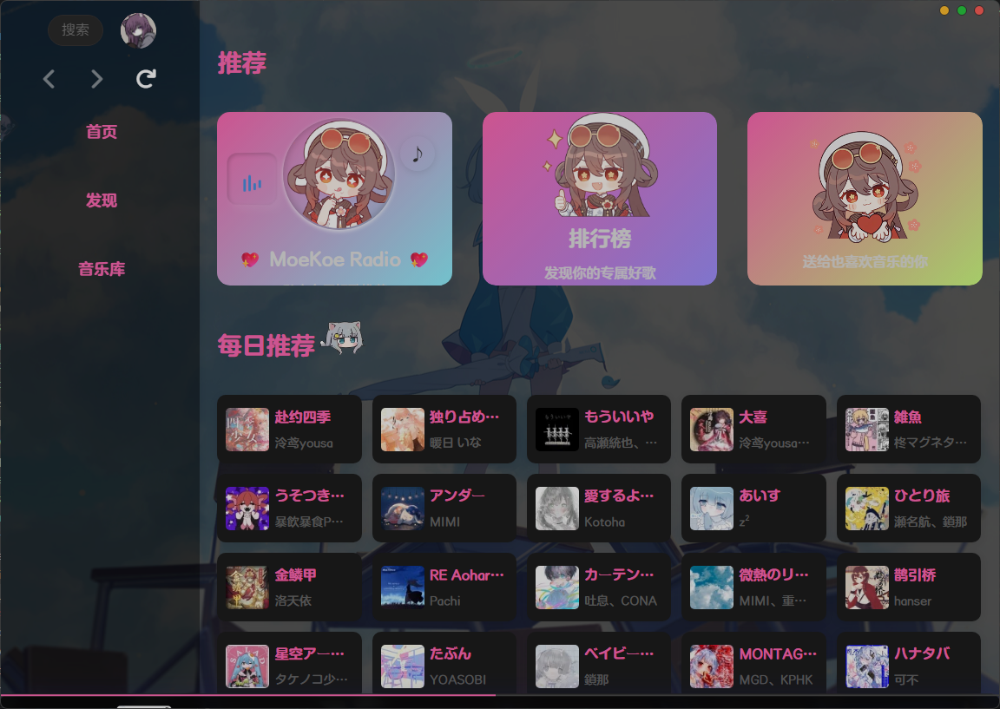

# moekoe-blue_archive-theme

The sky blue archive✨

> [!WARNING]
> 主题仍在开发中，可能不稳定

## 安装

1. 通过插件市场安装
2. 手动安装
    1. [下载](https://github.com/LateDreamXD/moekoe-blue_archive-theme/releases/latest)主题包 (.zip)
	2. 打开 MoeKoe Music，点击 `设置` -> `插件` -> `安装插件`，选择刚刚下载的主题包
	3. 点击刷新按钮即可

## 感谢

- [《蔚蓝档案》手游官方网站](https://bluearchive-cn.com/) - 提供了主题使用的部分背景图片
- [kivo.wiki](https://kivo.wiki/) - 提供了主题使用的字体、图标和部分背景图片
- [vue-ba-spark](https://npmx.dev/package/vue-ba-spark) - 点击特效
- [阿珏](https://github.com/iAJue) - 创造了 [MoeKoe Music](https://github.com/iAJue/MoeKoeMusic)
